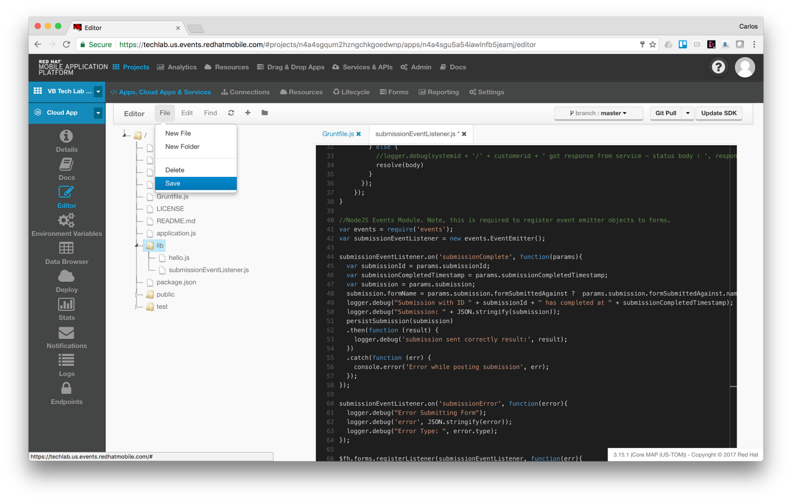
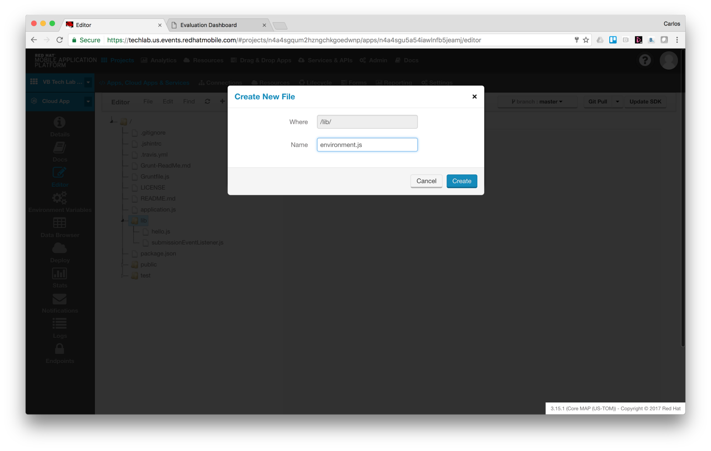

Contents

[[TOC]]

# Introduction

This guide should help you creating a mobile application to provide feedback (for an event for example) and see results in real time in a dashboard (web application).

As you run through the steps you’ll create a mobile app, a web application and an MBaaS service to persist the form submissions to a backend (incidentally MongoDB, but it could be any other system of record).

# Pre-requisites

In order to run this guide you will need

* A Red Hat Mobile environment. 
	* We’re going to assume you’re going to run this guide in this environment [https://techlab.us.events.redhatmobile.com](https://techlab.us.events.redhatmobile.com)
* You will need a GIT client installed locally.

# Log in to RHMAP

You should have been provided with a user to access the platform. If not please request your credentials to the Redhatter in charge of the session.

Log in with your credentials [https://techlab.us.events.redhatmobile.com](https://techlab.us.events.redhatmobile.com)


# Creating a Form to capture feedback

Go to Drag & Drop Apps


Now go to the Form Builder


Let’s create a new form.


Please choose template ‘Feedback Form’ to and give the form a name.
Hint: Use your initials as in the next picture to locate it later easily


Your form should look like this one.


Let’s add a new field. To do so, please click on the field button on the right side of the screen, on the button bar.
Then select the radio button type of field and drag it under the radio button to capture the experience evaluation.


Click on you new field to edit it. Now click on the Field Tab on the right, and change the name of the field to ‘Would you repeat?’


Now let’s change the options values: Yes, No, I don’t know


Click on field ‘Further comments’ and change it to not required by unchecking the Required flag as in the next picture.

    
Please do the same with ‘Today’s Date’ field as in the next picture.’


Now your form should look like this.


Now, please, click on ‘Save & Deploy’ and then click on Deploy (your environment should be already selected as you are assigned to only on environment).


# Creating a Project to use this form

Let’s go to ‘Drag & Drops Apps’ and then click on ‘Form Projects’


Now click on ‘New Forms Project’


Click on ‘Create New Project’


Let’s give the project a name.


Click Next


Select ‘Tech Forum Theme v1.0’ and select the form you created previously.


Click ‘Save’ and ‘Finish’ to start creating the assets of your new project.


You should see something similar to the next picture. Now we have to deploy and start our Cloud App, so click on ‘Jump to this App’


Next picture shows relevant information about key properties and status of the Cloud App.


Click on the ‘Deploy’ item on the left button bar (cloud icon).


Make sure runtime is ‘Node.js - 4.4.3’ and click the ‘Deploy Cloud App’ button. After some seconds you should see all green.


Now click on the item ‘Apps, Cloud Apps & Services’, we’re going to test the Client App.


If everything is fine you should see the simulator as in the next picture. You should see a button with the name of the form we selected when we created the project.


Now let’s use the simulator on the right of the screen. Click on the button for your form and fill the form with some data and click ‘Submit’. After a second or so you should see some messages at the top of the screen, one of them green.


Now let’s go see if our submitted data is in it’s place. Click on ‘Forms’ at the top bar.


Now on the left click on ‘Form Submissions’ (highlighted in white color)


Ok, so far we have tested the app using the simulator, now let’s build an Android binary to test our app in an actual device. Click on the ‘Build’ icon on the left (highlighted in blue)


Click on the ‘Android’ button and make sure your environment is selected on the upper right corner of the working area. Then click on the ‘Build’ button. Pay attention to the ‘Selected Cloud App’ drop down, this setting allows the app connect to the required Cloud App. After a minute or so you should see a QR code to download your App to an Android device.


# Adding a trigger to push form data to a connector

Go to the Cloud App and choose ‘Editor’. Now click on ‘lib’ folder and then ‘File→New File.


Let’s give the file this name: submissionEventListener.js


Now copy and paste the following code:

```
var express = require('express');
var $fh = require('fh-mbaas-api');
	
const env = require('./environment');
	
function persistSubmission(submission) {
    return new Promise(function(resolve, reject) {
      if (typeof env.BACKEND_SERVICE_GUID === 'undefined') {
        reject('Enviroment variable BACKEND_SERVICE_GUID not defined in Cloud App!');
        return;
      }
	
      var path = '/submissions';
      console.log('path: ' + path);
	
      $fh.service({
        "guid" : env.BACKEND_SERVICE_GUID, // The 24 character unique id of the service
        "path": path, //the path part of the url excluding the hostname        
        "method": "POST",   //all other HTTP methods are supported as well.
        "timeout": 25000, // timeout value specified in milliseconds. Default: 60000 (60s)
        "params": submission
      }, function(err, body, response) {
        console.log('statuscode: ', response && response.statusCode);
        if (err) {
          // An error occurred during the call to the service. log some debugging information
          console.log(path + ' service call failed - err : ', err);
          reject(err)
        } else {
          resolve(body)
        }
      });
    });
}

//NodeJS Events Module. Note, this is required to register event emitter objects to forms.
var events = require('events');
var submissionEventListener = new events.EventEmitter();

submissionEventListener.on('submissionComplete', function(params){
  var submissionId = params.submissionId;
  var submissionCompletedTimestamp = params.submissionCompletedTimestamp;
  var submission = params.submission;
  submission.formName = params.submission.formSubmittedAgainst ?  params.submission.formSubmittedAgainst.name : 'N/A';
  console.log("Submission with ID " + submissionId + " has completed at " + submissionCompletedTimestamp);
  console.log("Submission: " + JSON.stringify(submission));
  persistSubmission(submission)
  .then(function (result) {
    console.log('submission sent correctly result:', result);
  })
  .catch(function (err) {
    console.error('Error while posting submission', err);
  });
});

submissionEventListener.on('submissionError', function(error){
  console.log("Error Submitting Form");
  console.log('error', JSON.stringify(error));
  console.log("Error Type: ", error.type);
});

$fh.forms.registerListener(submissionEventListener, function(err){
  console.log('registering listener: submissionEventListener');
  if (err) return handleError(err);

  //submissionEventListener has now been registered with the $fh.forms Cloud API. Any valid Forms Events will now emit.
});
```

Click ‘File→ Save’


Create a new file at ‘lib’ folder. Name it: environment.js


Paste the following code and then ‘Save’:

```
const FORM_ID = process.env.FORM_ID || '585b9e888772c41836b37dd0';
const BACKEND_SERVICE_GUID = process.env.BACKEND_SERVICE_GUID || 'hlcvqjpcf6raquhojqbbqnlp';

module.exports = { FORM_ID: FORM_ID, BACKEND_SERVICE_GUID: BACKEND_SERVICE_GUID };
```

Now open file application.js and add the following lines as in the picture. This code sets up the listener we have created before.

```
// Register Form Submission listener
require('./lib/submissionEventListener');
```


Now let’s go back to our Project view, click on ‘Apps, Cloud Apps & Services’. Click on the plus sign on the upper right corner of the box for MBaaS Services.


Now select the service where we want to send our form data capture by the submissions event listener: ‘Form Submissions Backend Service’


Now click on the service itself to get the service ID.


Now let’s create an environment variable. Click on ‘Add Variable’


Variable Name: BACKEND_SERVICE_GUID ⇒ Variable Value: hlcvqjpcf6raquhojqbbqnlp


Click on ‘Push Environment Variables’


You’ll see a warning like in the next picture. Please click on ‘Confirm’


Now let’s try again from the Client App simulator, this time the submission value will end up in the MongoDB through the ‘Form Submissions Backend Service’.
