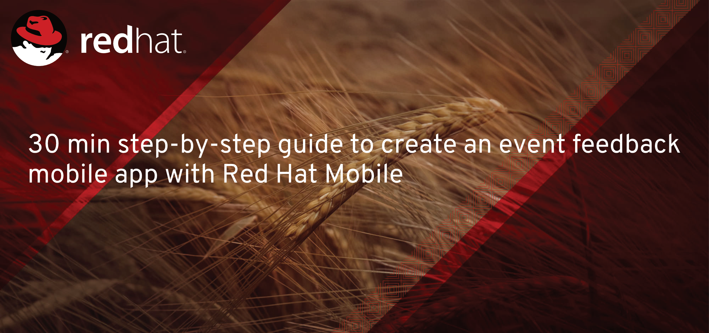

Contents

<!-- toc -->

- [Introduction](#introduction)
- [Pre-requisites](#pre-requisites)
- [Log in to RHMAP](#log-in-to-rhmap)
- [Creating a Form to capture feedback](#creating-a-form-to-capture-feedback)
- [Creating a Project to use this form](#creating-a-project-to-use-this-form)
- [Adding a trigger to push form data to a connector](#adding-a-trigger-to-push-form-data-to-a-connector)

<!-- tocstop -->

# Introduction

This guide should help you creating a mobile application to provide feedback (for an event for example) and see results in real time in a dashboard (web application).

As you run through the steps you’ll create a mobile app, a web application and an MBaaS service to persist the form submissions to a backend (incidentally MongoDB, but it could be any other system of record).

# Pre-requisites

In order to run this guide you will need

* A Red Hat Mobile environment. 
	* We’re going to assume you’re going to run this guide in this environment [https://techlab.us.events.redhatmobile.com](https://techlab.us.events.redhatmobile.com)
* You will need a GIT client installed locally.

# Log in to RHMAP

You should have been provided with a user to access the platform. If not please request your credentials to the Redhatter in charge of the session.

Log in with your credentials [https://techlab.us.events.redhatmobile.com](https://techlab.us.events.redhatmobile.com)

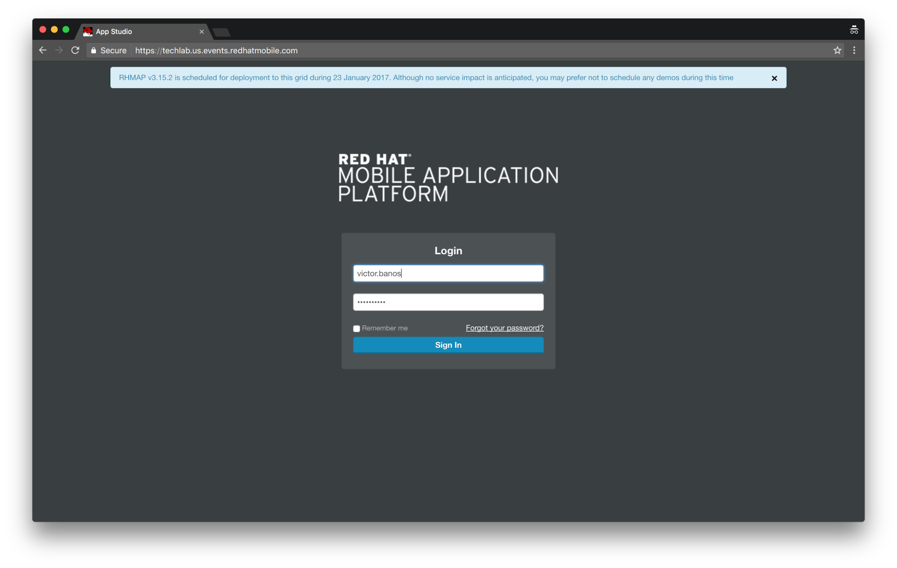


# Creating a Form to capture feedback

Go to Drag & Drop Apps


Now go to the Form Builder


Let’s create a new form.


Please choose template ‘Feedback Form’ to and give the form a name.
Hint: Use your initials as in the next picture to locate it later easily
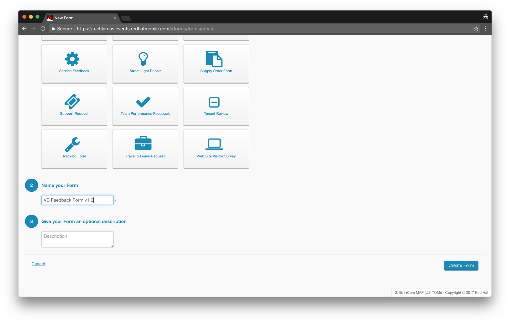


Your form should look like this one.


Let’s add a new field. To do so, please click on the field button on the right side of the screen, on the button bar.
Then select the radio button type of field and drag it under the radio button to capture the experience evaluation.


Click on you new field to edit it. Now click on the Field Tab on the right, and change the name of the field to ‘Would you repeat?’


Now let’s change the options values: Yes, No, I don’t know
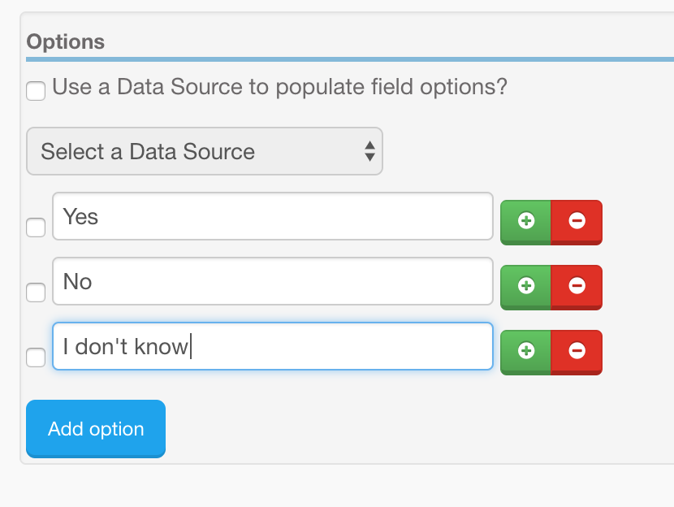

Click on field ‘Further comments’ and change it to not required by unchecking the Required flag as in the next picture.

    
Please do the same with ‘Today’s Date’ field as in the next picture.’


Now your form should look like this.


Now, please, click on ‘Save & Deploy’ and then click on Deploy (your environment should be already selected as you are assigned to only on environment).


# Creating a Project to use this form

Let’s go to ‘Drag & Drops Apps’ and then click on ‘Form Projects’
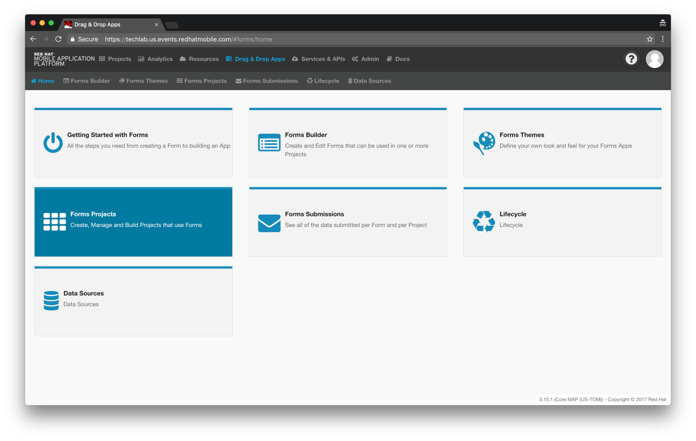

Now click on ‘New Forms Project’


Click on ‘Create New Project’


Let’s give the project a name.


Click Next


Select ‘Tech Forum Theme v1.0’ and select the form you created previously.


Click ‘Save’ and ‘Finish’ to start creating the assets of your new project.


You should see something similar to the next picture. Now we have to deploy and start our Cloud App, so click on ‘Jump to this App’
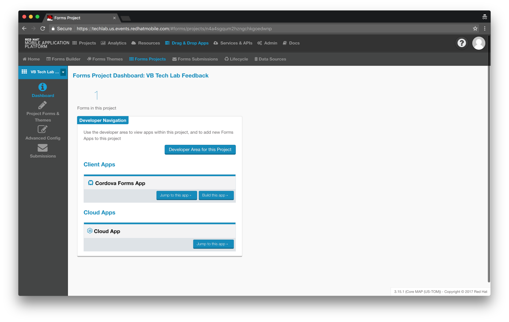

Next picture shows relevant information about key properties and status of the Cloud App.


Click on the ‘Deploy’ item on the left button bar (cloud icon).


Make sure runtime is ‘Node.js - 4.4.3’ and click the ‘Deploy Cloud App’ button. After some seconds you should see all green.


Now click on the item ‘Apps, Cloud Apps & Services’, we’re going to test the Client App.
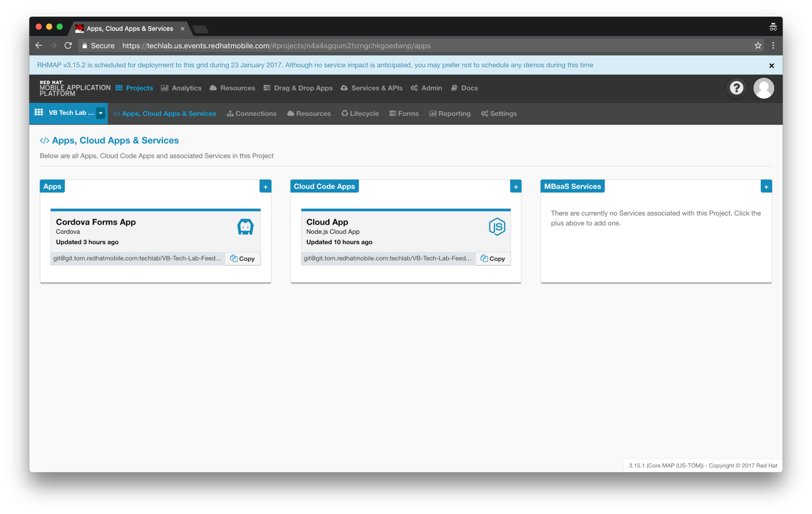

If everything is fine you should see the simulator as in the next picture. You should see a button with the name of the form we selected when we created the project.


Now let’s use the simulator on the right of the screen. Click on the button for your form and fill the form with some data and click ‘Submit’. After a second or so you should see some messages at the top of the screen, one of them green.


Now let’s go see if our submitted data is in it’s place. Click on ‘Forms’ at the top bar.
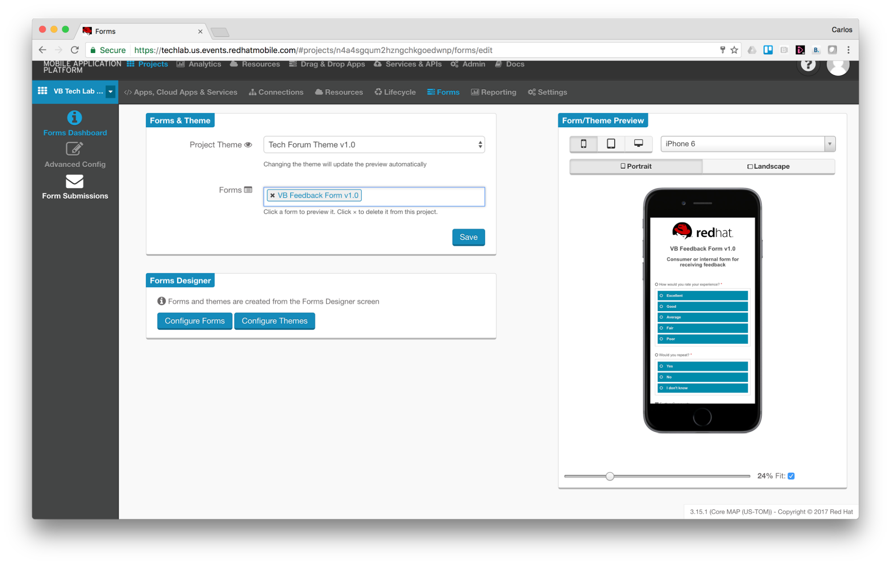

Now on the left click on ‘Form Submissions’ (highlighted in white color)


Ok, so far we have tested the app using the simulator, now let’s build an Android binary to test our app in an actual device. Click on the ‘Build’ icon on the left (highlighted in blue)


Click on the ‘Android’ button and make sure your environment is selected on the upper right corner of the working area. Then click on the ‘Build’ button. Pay attention to the ‘Selected Cloud App’ drop down, this setting allows the app connect to the required Cloud App. After a minute or so you should see a QR code to download your App to an Android device.
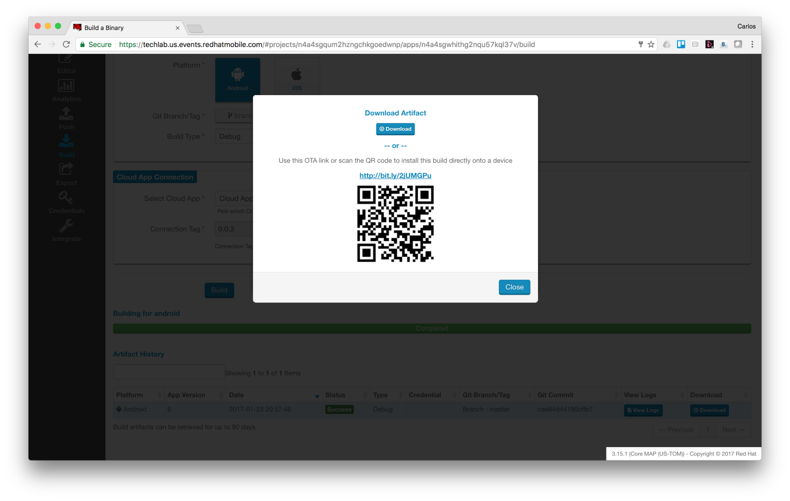

# Adding a trigger to push form data to a connector

At this step we're going to use an additional npm module, ``fh-form-listener``, which will persist our submissions everytime a submission object has been received completely.

***By 'received completely' we mean specifically that an event 'submissionComplete' is emitted by the platform through the FH API.***

**Note:**
FH API is 'loaded' in line 1 ``var mbaasApi = require('fh-mbaas-api')``

To achieve the goal stated above we need to do the following:

## Add a new dependency in package.json
1. Go to the Cloud App and choose ‘Editor’. Now click on ‘/package.json’ file to open it on the right pane.
2. Add the following dependency ``"fh-form-listener": "^1.0.6"`` as in the picture below
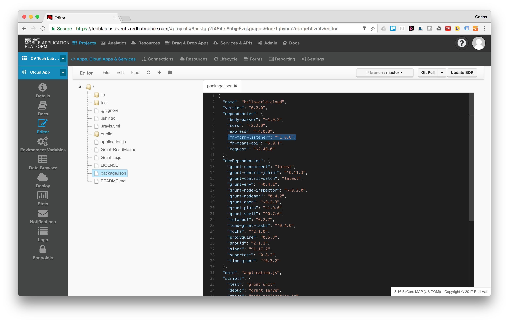
3. Click ‘File→ Save’
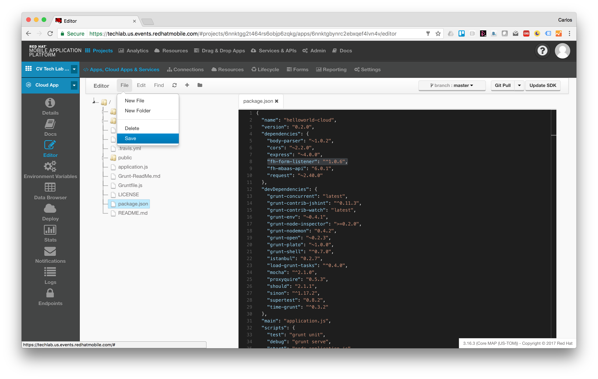

## Set up the listener in application.js
Our goal here is creating an event emitter/listener that listens to the event ``submissionComplete`` and then send the submission object to a connector.

So our code first create a new Event Emitter object with ``new events.EventEmitter()`` then it 'requires' the ``fh-form-listener`` module and call the ``attach`` method. Finally we register the event emitter/receiver with ``mbaasApi.forms.registerListener``.

So, what does our ``fh-form-listener`` module do? It adds a handler to the Event Emitter object we pass through the ``attach`` method for the event 'submissionComplete' and when one of those events is received it calls a connector. How does fh-form-listener know which service ID to use? This module expects ``BACKEND_SERVICE_GUID``*(1)* environment variable to be defined and pointing to the right connector and optionally variable ``BACKEND_SERVICE_PATH`` to define the path of the endpoint it will post the submission object to, if this variable is not set it will use ``/submissions`` as the default path. In this lab the connector has an endpoint for HTTP verb POST at ``/submissions`` path so no need to define this variable.

*(1) ``BACKEND_SERVICE_GUID`` enviroment variable is set later in this chapter.*

These are the steps we need to take.

1. Go to the Cloud App and choose ‘Editor’. Now click on ‘/application.js' file to open it on the right pane.
2. Add the following lines of code before the list of securable endpoints (around line 6) as in the picture below

```
// Register Form Submission listener
var events = require('events');
mbaasApi.forms.registerListener(require('fh-form-listener').attatch(new events.EventEmitter()), 
  function(err){
  if (err) return console.error('Error while registering listener', err);
  console.log('Listener fh-form-listener registered');
});
```
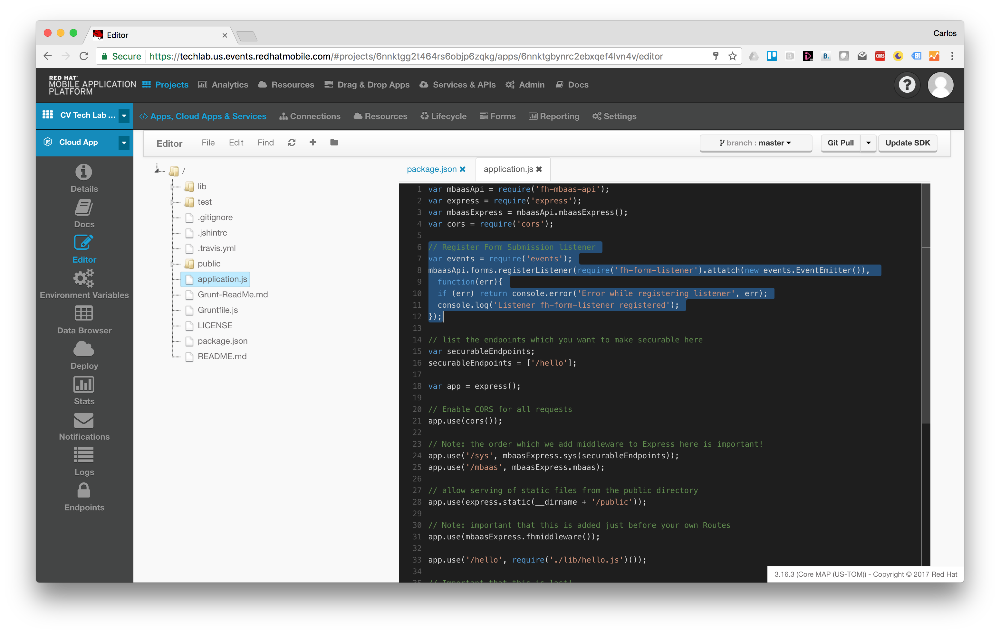
3. Click ‘File→ Save’
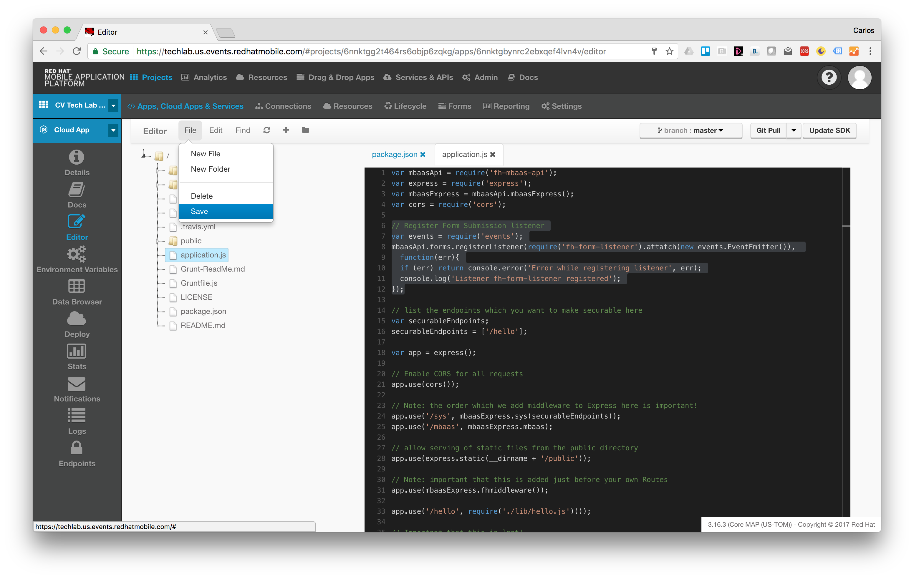

### Deploy the new version

Click on the ‘Deploy’ item on the left button bar (cloud icon).


Make sure runtime is ‘Node.js - 4.4.3’ and click the ‘Deploy Cloud App’ button. After some seconds you should see all green.


### Add the persistence connector to our project

Now let’s go back to our Project view, click on ‘Apps, Cloud Apps & Services’. Click on the plus sign on the upper right corner of the box for MBaaS Services.


Now select the service where we want to send our form data capture by the submissions event listener: ‘Form Submissions Backend Service’
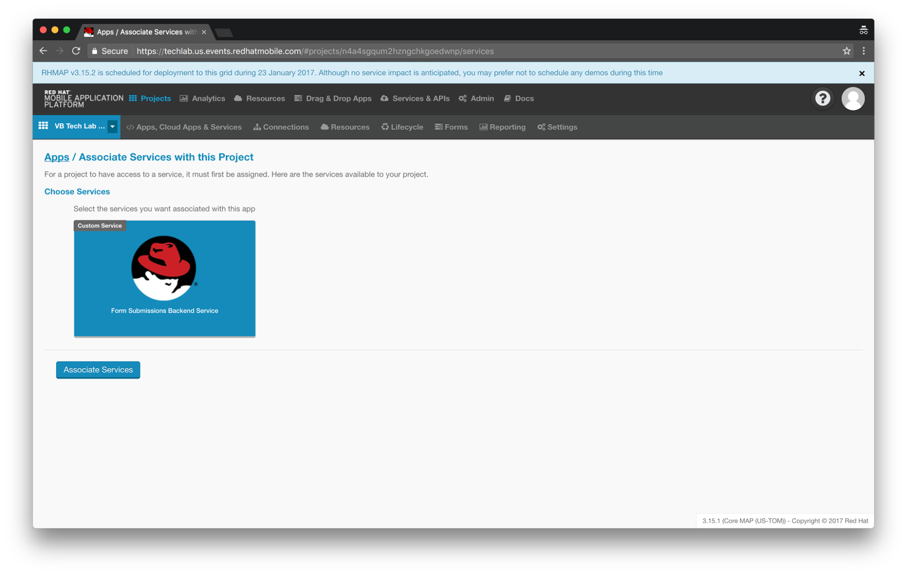

Now click on the service itself to get the service ID.


Now let’s create an environment variable. Click on ‘Add Variable’
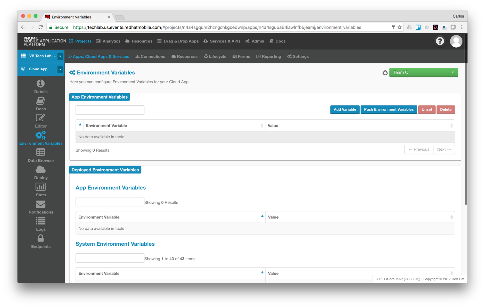

Variable Name: BACKEND_SERVICE_GUID ⇒ Variable Value: hlcvqjpcf6raquhojqbbqnlp
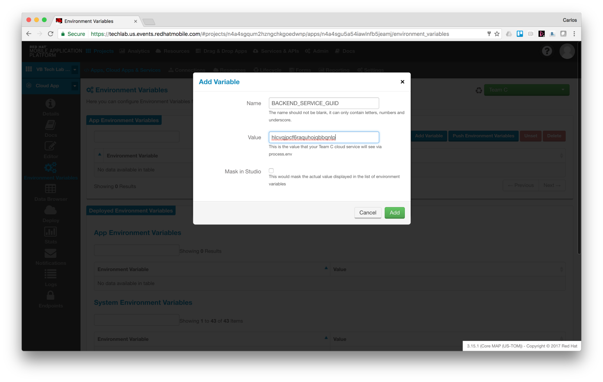

Click on ‘Push Environment Variables’


You’ll see a warning like in the next picture. Please click on ‘Confirm’


Now let’s try again from the Client App simulator, this time the submission value will end up in the MongoDB through the ‘Form Submissions Backend Service’.
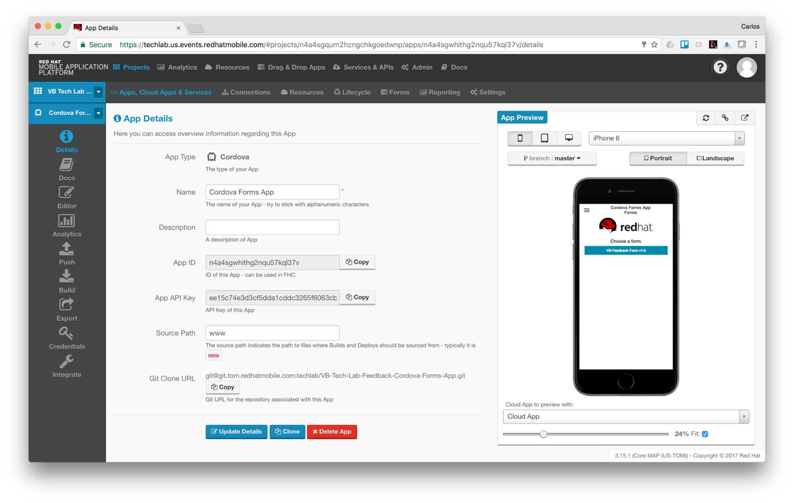